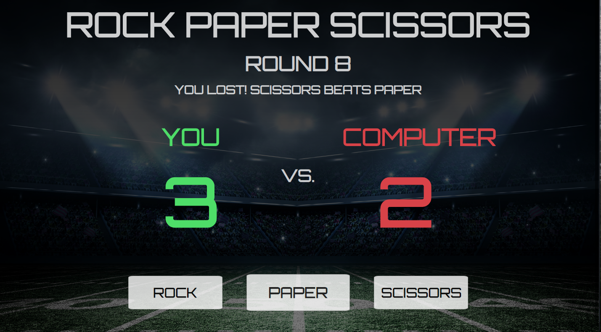

# Rock Paper Scissors

This project was part of The Odin Project JavaScript Curriculum.

# 

## Table of contents

1. [Demo](#demo)
2. [Technologies](#technologies)
3. [Features](#features)
4. [Development](#development)
5. [License](#license)

## Demo

Here is the working live demo:
[https://benjamin-gambling.github.io/rock-paper-scissors/](https://benjamin-gambling.github.io/rock-paper-scissors/).

## Technologies

- Vanilla JS, ES6+

## Features

- End game animations
- Fun Design
- Scores & Game

### Development

- Multiplayer

## License

> You can check out the full license [here](LICENSE)

This project is licensed under the terms of the **MIT** license.
